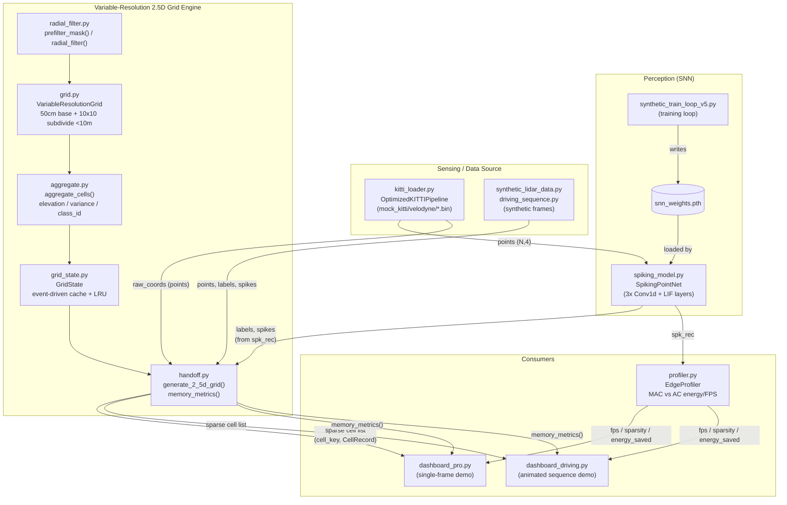
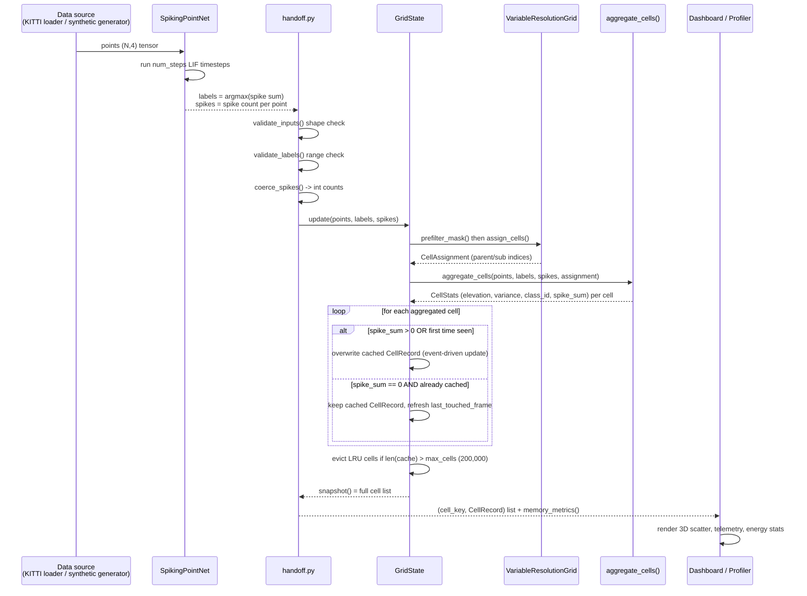

# AVRLM — Project Documentation

This document describes the code as it currently exists in this repository.
It supersedes the older narrative/design docs where they've drifted from
the source (see [§10](#10-existing-documentation-index) for which ones and
why).

## 1. Overview

AVRLM implements **Adaptive Variable Resolution 2.5D LiDAR Mapping** for a
UGV (unmanned ground vehicle), built for a hackathon as one stage of a
5-6 person pipeline:

```
Raw LiDAR points -> Spiking PointNet++ -> semantic labels + spike counts
                  -> variable-resolution 2.5D grid engine
                  -> Streamlit dashboards
```

`CLAUDE.md` frames this repo as "Member 3's module" (just the grid engine),
but the working tree has grown to also host the SNN model, its training
loop, the KITTI-style data loader, two full dashboards, and a
MAC-vs-AC energy profiler — effectively the whole pipeline in one place.
This doc covers all of it, organized by role.

## 2. System Design & Workflow Diagrams

### System design (components & data contracts)



The **fixed contract** at the `HANDOFF` boundary is
`generate_2_5d_grid(points, labels, spikes)` — see [§4](#4-data-contract).
Everything left of it (sensing + SNN) is interchangeable as long as it
produces that shape; everything right of it (dashboards, profiler) only
ever reads the grid engine's sparse cell output, never raw points.

### Per-frame workflow (what happens on every frame)



The key behavior this diagram makes explicit: a cell is only recomputed
when it received spiking points **this frame** — otherwise `GridState`
returns its cached value untouched, which is the event-driven update
model described for `grid_state.py` in [§5](#5-core-gridquadtree-engine)
and `CLAUDE.md`.

## 3. Repository Layout

```
AVRLM/
├── grid.py                         core: two-level 50cm/5cm grid
├── aggregate.py                    core: per-cell elevation/class stats
├── radial_filter.py                core: 10m/100m radial split
├── grid_state.py                   core: event-driven cell cache + LRU
├── handoff.py                      core: generate_2_5d_grid() contract fn
├── dashboard_state.py              core: pure playback-state helper
│
├── synthetic_lidar_data.py         synthetic per-frame scene generator
├── driving_sequence.py             scripted multi-frame demo scenario
│
├── spiking_model.py                SpikingPointNet (SNN architecture)
├── kitti_loader.py                 KITTI-like point cloud DataLoader
├── synthetic_train_loop_v5.py      SNN training loop (writes snn_weights.pth)
├── profiler.py                     EdgeProfiler (MAC vs AC energy/FPS)
├── integration_pipeline.py         end-to-end demo: loader -> SNN -> grid
│
├── dashboard_pro.py                single-frame click-to-generate dashboard
├── dashboard_driving.py            animated multi-frame driving dashboard
│
├── test_grid.py, test_aggregate.py, test_radial_filter.py,
│   test_grid_state.py, test_handoff.py, test_integration.py,
│   test_packed_keys.py, test_stress.py, test_dashboard_driving.py
│
├── mock_kitti/velodyne/*.bin       sample mock point-cloud binaries
├── requirements.txt
├── .gitignore
│
├── CLAUDE.md, README.md, QUICKSTART.md, DESIGN.md, DESIGN-dash_pro.md
├── Reports/AUDIT.md, Reports/AUDIT-v2.md
├── Adaptive Variable Resolution Documentation.md   (untracked)
├── implement_audit_v2_fixes_guide.md, rebuild_test_suite_guide.md,
│   Plans_Agent/*.md                                (untracked, historical)
```

Note: `dashboard_pro_v1.py` and a `Desktop/sih_snn_engine/` backup
directory are referenced in older reports/git history but no longer exist
in the working tree.

## 4. Data Contract

Fixed interface between the SNN and the grid engine (`CLAUDE.md` §3),
with current enforcement status verified against source:

| Field    | Shape                               | dtype           | Enforced where                                                                                                                                                                                                                                                              |
| -------- | ----------------------------------- | --------------- | --------------------------------------------------------------------------------------------------------------------------------------------------------------------------------------------------------------------------------------------------------------------------- |
| `points` | `(N, 4)` = X, Y, Z, Intensity       | `float32`       | Shape checked by `handoff.validate_inputs()`; dtype is **not** hard-checked (NumPy silently accepts other float dtypes)                                                                                                                                                     |
| `labels` | `(N,)`, values in `{0,1,2}`         | `int64`/`uint8` | Shape/length checked by `validate_inputs()`; value range checked by `aggregate.validate_labels()` (raises `ValueError` naming the offending value)                                                                                                                          |
| `spikes` | `(N,)`, spike **count**, not a flag | `uint8`/`int32` | Shape/length checked by `validate_inputs()`; dtype is **coerced**, not rejected — `aggregate.coerce_spikes()` rounds non-integer arrays to the nearest int and warns once if a value moved by more than `1e-6`. Gating logic everywhere uses `spike_sum > 0`, never `== 1`. |

Other rules, all confirmed in current source:

- **Ego-centric frame**: UGV always at `(0,0,0)`. No world-frame offsets
  appear anywhere in `grid.py`/`radial_filter.py`; `driving_sequence.py`
  explicitly transforms world coordinates to ego-centric before returning.
- **Z must not be NaN**: `aggregate_cells()` raises `ValueError` (naming
  the offending point indices) before computing elevation stats. **Inf is
  not checked** — it is accepted and can propagate a `RuntimeWarning`
  (`inf - inf = nan`) into the variance calculation; `test_stress.py`
  documents this as a known, intentionally-unguarded gap.
- **Intensity** (`points[:, 3]`) is dropped after ingestion — no consumer
  reads it downstream of the loader/generator stage.
- **Class IDs are fixed**: `0` = drivable terrain, `1` = static obstacle,
  `2` = dynamic object (`aggregate.NUM_CLASSES = 3`).

## 5. Core Grid/Quadtree Engine

### `grid.py`

Two-level hierarchical grid: a base 50cm grid over `[-100m, 100m]`; any
50cm cell whose **center** falls within 10m of the origin is subdivided
into a fixed 10×10 array of 5cm sub-cells. This is deliberately not a
textbook 2×2 recursive quadtree — halving 50cm repeatedly never lands
exactly on 5cm (10 isn't a power of 2).

- `INNER_RES=0.05`, `OUTER_RES=0.50`, `INNER_RADIUS=10.0`,
  `OUTER_RADIUS=100.0`, `SUBDIV_FACTOR = round(OUTER_RES/INNER_RES) = 10`
  (computed, not hardcoded).
- `parent_cell_center(parent_ix, parent_iy) -> (x, y)` — world-space
  center of a 50cm parent cell.
- `sub_cell_center(parent_ix, parent_iy, sub_ix, sub_iy) -> (x, y)` —
  world-space center of a 5cm sub-cell, computed from the **parent's own
  origin** (never an independent fine-grid origin — this is what
  guarantees zero seam error at the 10m boundary).
- `class CellAssignment(parent_ix, parent_iy, is_fine, sub_ix, sub_iy, in_range)`
  — per-point cell assignment; `-1` sentinel for sub-cell fields when not
  subdivided, `-1` everywhere for out-of-range points.
- `class VariableResolutionGrid.assign_cells(points) -> CellAssignment`:
  floor-divides points into parent cells, decides subdivision **once per
  unique parent cell** (by that cell's center distance, never per point —
  so a cell can't be half-subdivided), then computes sub-indices only for
  points inside subdivided cells as a local offset from that parent's
  origin. Parent-cell dedup uses a packed 1D int64 key
  (`parent_ix*1024 + parent_iy`) instead of `np.unique(axis=0)` for
  performance.

### `aggregate.py`

Per-cell elevation and semantic aggregation — fully vectorized (bincount /
`np.maximum.at`, no Python loop over points).

- `validate_labels(labels, num_classes=3)`: raises `ValueError` naming the
  bad value if any label falls outside `[0, num_classes)`.
- `coerce_spikes(spikes) -> np.ndarray`: rounds non-integer spikes to the
  nearest int, warns once if rounding moved a value by more than `1e-6`;
  passes integer dtypes through unchanged.
- `class CellStats(...)`: parallel-array container — one row per occupied
  cell, with `elevation_max`, `elevation_var`, `class_id`, `point_count`,
  `spike_sum`, plus cell coordinates.
- `aggregate_cells(points, labels, spikes, assignment) -> CellStats`:
  - Raises `ValueError` (naming point indices) if any in-range point's Z
    is NaN.
  - Dedups the 4-column cell key via a packed 1D int64 key (same
    perf pattern as `grid.py`).
  - `elevation_max`: vectorized scatter-max via `np.maximum.at`.
  - `elevation_var`: population variance (`ddof=0`), clamped at 0.
  - `class_id`: majority vote via `bincount`; **ties favor the highest
    class ID** (dynamic > static > drivable) — the argmax runs over
    reversed columns so the tie-break lands on the highest original index.
  - `spike_sum`: weighted bincount of spike counts per cell.

### `radial_filter.py`

- `radial_filter(points) -> (inner_mask, outer_mask)`: a **non-authoritative**
  diagnostic split (`inner: r<=10`, `outer: 10<r<=100`). Imports
  `INNER_RADIUS`/`OUTER_RADIUS` from `grid.py` so the two modules can't
  drift apart.
- `prefilter_mask(points) -> bool array`: the actual gate used before
  `grid.assign_cells()` — `r <= 100.0`.

### `grid_state.py`

Event-driven persistent grid cache: a dict keyed by
`(parent_ix, parent_iy, sub_ix, sub_iy) -> CellRecord`.

- A cell's cached record is overwritten when **either** this frame's
  `spike_sum > 0` for that cell, **or** the cell has never been recorded
  before (cold-start baseline — otherwise a first frame with few spikes
  would silently drop most of the scene).
- `DEFAULT_MAX_CELLS = 200_000`; `GridState.update()` performs
  prefilter -> `assign_cells` -> `aggregate_cells`, commits changed/new
  cells, and evicts least-recently-_touched_ cells (`OrderedDict.popitem(last=False)`)
  once the cache exceeds the cap — a cell touched this frame is never
  evicted in the same call.
- `GridState.snapshot() -> list[(key, CellRecord)]`: the full current
  cache.

### `handoff.py` — the fixed team integration contract

- `_state = GridState()` — a module-level singleton, since the fixed
  `generate_2_5d_grid` signature takes no explicit state argument.
- `validate_inputs(points, labels, spikes)`: shape/length checks, run
  before the narrower per-field checks.
- **`generate_2_5d_grid(points, labels, spikes) -> list[(cell_key, CellRecord)]`**
  — the fixed handoff function. Runs `validate_inputs` ->
  `validate_labels` -> `coerce_spikes` -> `_state.update()` ->
  `_state.snapshot()`.
- `memory_metrics(state=None) -> dict`: `active_cell_count`,
  `estimated_sparse_bytes` (from `CellRecord`'s actual field byte-widths),
  `naive_dense_bytes` (a dense 5cm voxel grid over the full 200×200m
  footprint at an assumed 3m height band), `savings_ratio`.

### `dashboard_state.py`

- `advance_frame_index(frame_idx, total_frames) -> int | None`: pure
  playback-state helper (no Streamlit/torch imports) extracted from
  `dashboard_driving.py` so it's unit-testable in isolation. Returns
  `None` once the sequence is exhausted.

## 6. Synthetic Data Generation

### `synthetic_lidar_data.py`

Generates synthetic frames matching the data contract, for testing the
grid engine without a trained model or a real dataset.
`LABEL_DRIVABLE=0, LABEL_STATIC=1, LABEL_DYNAMIC=2`.

- `generate_ground_plane(r_max=100.0, n_rings=600, pts_per_ring=40, z_noise=0.02, rng=None)`
  — flat drivable terrain, label 0, ~2% random spike rate.
- `generate_pole(center_xy, height=2.0, radius=0.08, n_points=120, rng=None)`
  — vertical static-obstacle cylinder shell, label 1, spikes in `[1,4)`.
- `generate_dynamic_cluster(center_xy, n_points=60, spread=0.35, height=1.7, rng=None)`
  — Gaussian-blob moving object, label 2, spikes in `[3,8)`.
- **`generate_boundary_stress_ring(radius=10.0, n_points=400, jitter=0.02, rng=None)`**
  — a dense ring of points jittered ±2cm around exactly r=10m. **The
  single most important test scene for the quadtree logic** — it directly
  stresses the 5cm/50cm seam. Label 0, all spikes 0.
- `build_scene(include_boundary_stress=True, rng=None)`: one full frame —
  ground + 2 poles + 1 dynamic cluster (+ boundary ring by default).
- **`build_moving_sequence(n_frames=10, start_xy=(6.0,-3.0), velocity=(0.4,0.15), rng=None)`**
  — a multi-frame list where the dynamic cluster's center moves linearly
  each frame. Used to verify event-driven behavior: after frame 0, only
  cells under the moving cluster should refresh.
- Every generator defaults to its own `rng = np.random.default_rng(42)`
  when `rng=None`, so callers can pass a shared RNG for true randomness
  across a sequence or rely on the seeded default for reproducible tests.
- Has a `__main__` block that prints scene stats when run directly:
  `py synthetic_lidar_data.py`.

### `driving_sequence.py`

A scripted, narrative UGV driving scenario built on top of
`synthetic_lidar_data.py`'s primitives, used only by `dashboard_driving.py`:
5 fixed static poles, 1 pedestrian crossing the UGV's path, 1 car
overtaking from behind. The UGV moves at `UGV_SPEED=1.5` m/s along +X.

- `get_ugv_position(frame_idx) -> (x, y)`.
- `build_driving_frame(frame_idx, rng) -> (points, labels, spikes, ugv_pos)`
  — transforms every world-frame object into UGV-ego-centric coordinates
  and drops anything outside ±100m.
- `build_driving_sequence(n_frames=40, seed=2026) -> list[frame tuples]`.
- **Deliberately has no `__main__` block** — an earlier version's print
  statements fired on every `streamlit run` launch, because Streamlit's
  script-reload model doesn't reliably respect the `__main__` guard the
  way plain `python file.py` does.

## 7. SNN Model, Training, Data Loading, Integration

### `spiking_model.py`

- `class SpikingPointNet(nn.Module).__init__(self, beta=0.9, num_steps=10)`
  — three `Conv1d` layers (4→64→128→3, kernel_size=1) each followed by a
  `snn.Leaky` LIF layer (fast-sigmoid surrogate gradient, `init_hidden=True`).
  `forward(self, x)` resets hidden state each call and loops `num_steps`
  times, returning `torch.stack(spk_rec)` of shape
  `(num_steps, batch, 3, num_points)`.

### `kitti_loader.py`

`class OptimizedKITTIPipeline(Dataset)` — a KITTI-like point cloud loader
with three per-frame stages, all vectorized:

1. `_voxel_downsample` — O(N) voxel-grid filter via integer voxel hashing
   (`_voxel_hash`), one representative point per occupied voxel.
2. `_range_weighted_fps` — farthest-point sampling weighted by
   `1.0 + 0.05*range` (biases toward distant/sparse points), using an
   iterative min-distance formulation to avoid an O(N²) pairwise matrix.
3. `_temporal_delta_intensity` — marks a point "dynamic" (intensity 1.0
   vs. 0.2) if its voxel wasn't occupied in the previous frame, via a
   voxel-hash set difference.

`__getitem__(idx)` returns `{"norm_tensor": (4, target_pts) float32 in
[0,1] spatial + intensity, "raw_coords": (target_pts, 4) float32 meter-space}`.
Other functions: `kitti_collate_batch(batch)` (stacks into
`(B,4,8192)`/`(B,8192,4)` tensors), `get_streaming_dataloader(bin_filepaths, batch_size=4)`
(num_workers=2, pin_memory, prefetch_factor=2, persistent_workers),
`discover_and_sort_kitti_bins(root_dir)` (numeric-frame-sorted glob),
`create_mock_bin_files(dir_path, count=5)` (writes fake 50,000-point
`.bin` files — this is what populates `mock_kitti/velodyne/`). Has a
`__main__` smoke test: `py kitti_loader.py`.

### `synthetic_train_loop_v5.py`

Training loop for `SpikingPointNet`. `CHECKPOINT_PATH="snn_weights.pth"`,
`NUM_POINTS=8192`, `MAX_RANGE=100.0`, `NUM_CLASSES=3`.

Context: v4 used aggressive class weights (`[1.0,6.0,20.0]`) and
oversampling (`minority_boost=11.0`), which caused 96.2% of a real
unbalanced scene to be misclassified as "Static Obstacle" once deployed —
it looked fine only because v4 validated exclusively on its own
artificially-balanced set. v5's fix: validate on **both** a
class-balanced set and a naturally-imbalanced ("realistic") set each
epoch, and dial weights back to `[1.0,7.0,16.0]` / `minority_boost=7.0`.

- `build_richer_scene(rng)`: ground + 2-5 random poles + 1-3 random
  dynamic clusters + 30% chance of a boundary-stress ring.
- `class_balanced_sample(points, labels, num_points, rng, minority_boost=7.0)`:
  inverse-frequency weighted resampling, boosting non-drivable classes.
- `uniform_sample(points, labels, num_points, rng)`: no balancing —
  mirrors real deployment distribution (used only for the "realistic"
  validation set).
- `scene_to_tensor`, `get_batch`, `weighted_spike_ce_loss`,
  `per_class_accuracy`, `evaluate` — standard supporting pipeline.
- `__main__`: 100 epochs × 25 batches/epoch × batch_size=4, Adam
  `lr=5e-4` with linear-warmup + cosine-decay, gradient clipping,
  checkpoints on the **best realistic minimum-class-accuracy** (not
  overall accuracy, since that's what the dashboard actually sees), and
  prints a final `EdgeProfiler` report. Run with `py synthetic_train_loop_v5.py`.

### `profiler.py`

`class EdgeProfiler`: `MAC_ENERGY_PJ=4.6`, `AC_ENERGY_PJ=0.9` (picojoules,
used for the MAC-vs-AC energy story).

- `evaluate_efficiency(self, spk_rec, process_time, batch_size) -> dict`:
  `fps`, `latency_sec`, `sparsity_pct` (fraction of neuron-states that
  never fired), `ac_ops`, `mac_ops_avoided`, `energy_saved_pj`.
- `print_report(self, metrics, epoch)`: formatted console report.

### `integration_pipeline.py`

`run_ugv_perception()`: wires `kitti_loader.get_streaming_dataloader` →
`SpikingPointNet` inference → `handoff.generate_2_5d_grid`/`memory_metrics`
in a per-frame loop over mock KITTI files, printing FPS and active-cell
count per frame. Run with `py integration_pipeline.py`.

## 8. Dashboards

Both dashboards load `SpikingPointNet`, run inference on a generated
scene, and pass the result through `handoff.generate_2_5d_grid` /
`memory_metrics`, then render the resulting cells as a 3D Plotly scatter.

### `dashboard_pro.py`

Single-frame, click-to-generate demo with a custom "Nocturne" dark theme
(heavy inline CSS, custom HTML-rendered telemetry/objects panels via
`render_telemetry_html`/`render_objects_panel_html`, custom polar-grid/
legend/HUD Plotly overlays, corner-bracket bounding boxes). Checkpoint
path (`snn_weights.pth`) is **CWD-relative** — run from the repo root.
State (`has_generated`, `last_df`, `last_perf`, `last_mem_stats`,
`last_latency`, `energy_hist`) lives in `st.session_state`. Optional
`sklearn.cluster.DBSCAN`-based object clustering (`cluster_objects`) if
scikit-learn is installed.

### `dashboard_driving.py`

Animated multi-frame driving-sequence demo built on `driving_sequence.py`.
Checkpoint path is **absolute** (derived from `__file__`), so it's
CWD-independent. Playback is entirely `st.session_state`-driven
(`driving_active`, `driving_frame_idx`, `driving_sequence`): each Streamlit
rerun advances exactly **one** frame and calls `st.rerun()`, rather than
blocking through the whole sequence in one callback — this was a
deliberate rearchitecture to survive a WebSocket reconnect without losing
progress. Renders full 12-edge bounding-box wireframes (vs.
`dashboard_pro.py`'s corner-bracket style), caps rendered drivable-class
points per frame at `DRIVABLE_DISPLAY_CAP = 6000` for performance, and
shows a 6-metric row including the sparse/dense memory savings ratio.

**Note on `DESIGN.md` / `DESIGN-dash_pro.md`**: both describe an earlier
state of these two files — no `st.session_state` in `dashboard_pro.py`;
a blocking per-click loop, a full checkpoint-path leak, and a frame-number
off-by-one in `dashboard_driving.py`. All of that has since been fixed in
source (confirmed by reading the current files). Treat those two docs as
historical design notes, not a current reference.

## 9. Test Suite

All 9 test files use pytest-discoverable `def test_...()` functions and
also carry an `if __name__ == "__main__":` block that calls every test in
order, so both `py test_X.py` and `pytest` work.

| File                        | Covers                                                                                                                                                                                      |
| --------------------------- | ------------------------------------------------------------------------------------------------------------------------------------------------------------------------------------------- |
| `test_grid.py`              | `SUBDIV_FACTOR==10`; boundary-ring sub-cell containment; full `build_scene()` pipeline sanity; out-of-range points                                                                          |
| `test_aggregate.py`         | Elevation/variance/class_id correctness for pole and ground scenes; `validate_labels` edge cases; NaN-Z guard; majority-vote tie-break                                                      |
| `test_radial_filter.py`     | Inner/outer split bounds on `build_scene()` and the boundary ring                                                                                                                           |
| `test_grid_state.py`        | Event-driven updates across `build_moving_sequence()` (unchanged cells stay bit-identical); cold-start baseline; LRU eviction under various fill/pressure patterns                          |
| `test_handoff.py`           | `generate_2_5d_grid` accumulation across calls; float-spike coercion + warning; `validate_inputs` shape/order checks                                                                        |
| `test_integration.py`       | Per-frame timing budget (≥8/10 frames under 100ms)                                                                                                                                          |
| `test_packed_keys.py`       | Differential parity: packed-int64 dedup vs. an independently reimplemented `np.unique(axis=0)`, plus injectivity/round-trip checks                                                          |
| `test_stress.py`            | 200+ validation-fuzzing cases (shape/label/NaN/Inf/dtype combinations); eviction under adversarial churn; long-horizon growth with the cache cap active                                     |
| `test_dashboard_driving.py` | `advance_frame_index` semantics; accumulated-grid survival across a simulated rerun; frame-counter/path-leak checks via source-text inspection (doesn't import the Streamlit module itself) |

## 10. Existing Documentation Index

- **`README.md`** — public-facing project pitch. Its dependency list
  (Open3D, PyVista, torch-geometric, etc.) does not match actual imports;
  treat `requirements.txt` as the accurate list.
- **`QUICKSTART.md`** — practical run instructions (pip install line,
  training the checkpoint first, `streamlit run` commands). Still accurate.
- **`CLAUDE.md`** — the agent-facing interface contract and design
  decisions this module was built against; still the reference for _why_
  the grid is structured the way it is.
- **`DESIGN.md`**, **`DESIGN-dash_pro.md`** — dashboard architecture docs;
  **partially stale** (see [§8](#8-dashboards)).
- **`Reports/AUDIT.md`** — first audit round; its "Round 2 fixes" section
  was later found to have never actually landed in source.
- **`Reports/AUDIT-v2.md`** — an independent re-audit; **the authoritative
  record of what's been fixed** (validation, NaN guard, tie-break
  direction, packed-key perf pass, LRU eviction, dashboard session-state
  fixes). Treat this over `AUDIT.md` wherever they conflict.
- **`Adaptive Variable Resolution Documentation.md`** (untracked) — the
  original hackathon pitch/motivation doc; useful background on _why_ an
  SNN + variable-resolution grid was chosen, not a technical reference for
  current code.
- **`implement_audit_v2_fixes_guide.md`**, **`rebuild_test_suite_guide.md`**,
  **`Plans_Agent/*.md`** (untracked) — historical task guides that
  produced the current source; useful for "how this evolved," not living
  documentation.

## 11. Config & Entry Points

**`requirements.txt`** (floor-pinned, reconciled against actual imports):
`streamlit>=1.50`, `pandas>=2.0`, `numpy>=1.26`, `plotly>=5.20`,
`torch>=2.0`, `snntorch>=1.0`, `scikit-learn>=1.3`. `numba` is listed but
commented out — CLAUDE.md's tech-stack section mentions Numba, but the
performance work actually done (packed-int64-key dedup) used plain NumPy,
not Numba.

**`.gitignore`** ignores all `*.md` **except** `README.md`, `CLAUDE.md`,
`DESIGN.md`, `DESIGN-dash_pro.md`, `QUICKSTART.md`, and `Reports/*.md` —
a deliberate policy so those tracked docs stay diff-visible against code
changes. This means the newly-written `DOCUMENTATION.md` is **currently
git-ignored**; add a `!/DOCUMENTATION.md` line if you want it tracked.

**How to run things** (from the repo root):

| Command                              | Purpose                                          |
| ------------------------------------ | ------------------------------------------------ |
| `py synthetic_lidar_data.py`         | Print synthetic scene stats                      |
| `py kitti_loader.py`                 | Mock-data DataLoader smoke test                  |
| `py synthetic_train_loop_v5.py`      | Train and write `snn_weights.pth`                |
| `py integration_pipeline.py`         | End-to-end demo: mock KITTI → SNN → grid         |
| `streamlit run dashboard_pro.py`     | Single-frame demo (CWD-relative checkpoint)      |
| `streamlit run dashboard_driving.py` | Animated driving demo (absolute checkpoint path) |
| `py test_X.py` or `py -m pytest -v`  | Run a test file / the whole suite                |

`grid.py`, `aggregate.py`, `radial_filter.py`, `grid_state.py`,
`handoff.py`, `profiler.py`, `driving_sequence.py`, `spiking_model.py`,
and `dashboard_state.py` are library modules only — no `__main__` block.

## 12. Known Gaps

- `aggregate_cells()` guards NaN Z but **not Inf** — an Inf Z value is
  accepted and can produce a `RuntimeWarning` (`inf - inf = nan`) in the
  variance calculation.
- `points`/`labels` dtypes are shape-checked but not dtype-checked in
  `validate_inputs()` — only spikes get an explicit coercion path.
- `README.md`'s dependency list doesn't match `requirements.txt` / actual
  imports.
- `DESIGN.md` and `DESIGN-dash_pro.md` describe an earlier version of both
  dashboards (see [§8](#8-dashboards)).
- Numba is named in `CLAUDE.md`'s tech stack but isn't used anywhere —
  the vectorized-perf work uses plain NumPy.
