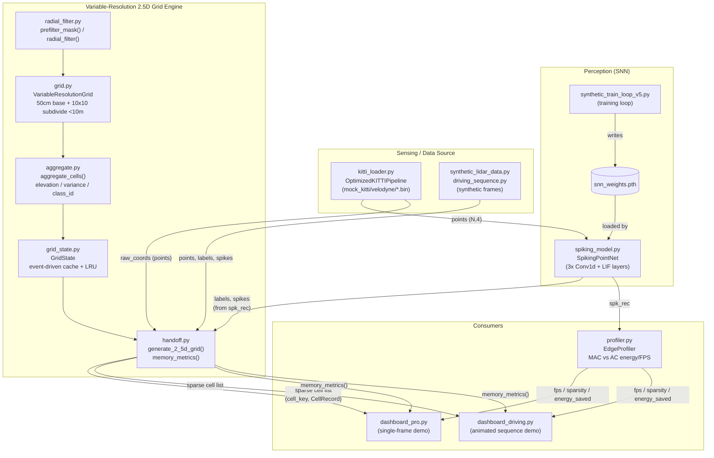
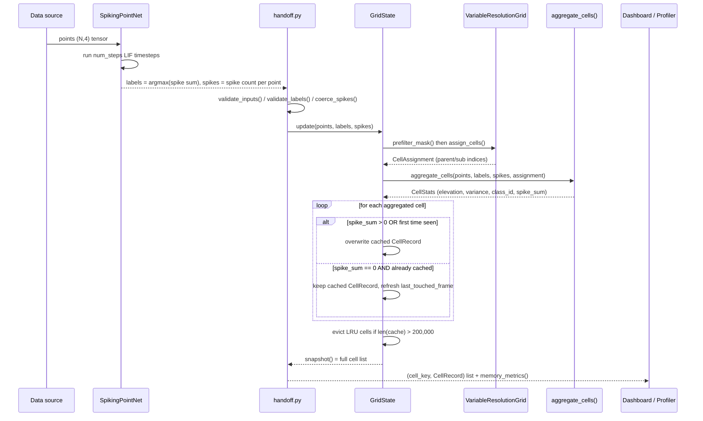

# AVRLM — Adaptive Variable Resolution 2.5D LiDAR Mapping

**A spiking-neural-network + variable-resolution grid pipeline for real-time UGV terrain mapping.**

AVRLM turns raw LiDAR point clouds into a compact, semantically-labeled 2.5D occupancy grid, using a Spiking PointNet++ for perception and an event-driven quadtree-style grid for spatial aggregation. It was built for a hackathon as one stage (originally "Member 3's module") of a larger 5–6 person perception pipeline, and has since grown to house the full pipeline end-to-end: data loading, the SNN model and its training loop, the grid engine, an energy profiler, and two interactive Streamlit dashboards.

```
Raw LiDAR points → Spiking PointNet++ → semantic labels + spike counts
                 → Variable-Resolution 2.5D Grid Engine
                 → Streamlit Dashboards
```

---

## Table of Contents

- [Why AVRLM](#why-avrlm)
- [Architecture](#architecture)
- [Repository Layout](#repository-layout)
- [Data Contract](#data-contract)
- [Core Components](#core-components)
  - [Grid Engine](#grid-engine)
  - [Synthetic Data Generation](#synthetic-data-generation)
  - [SNN Model, Training & Loading](#snn-model-training--loading)
  - [Dashboards](#dashboards)
- [Getting Started](#getting-started)
- [Running the Pipeline](#running-the-pipeline)
- [Testing](#testing)
- [Known Limitations](#known-limitations)
- [Documentation Index](#documentation-index)
- [License](#license)

---

## Why AVRLM

Dense, uniform-resolution occupancy grids waste memory and compute representing terrain far from the vehicle at the same fidelity as terrain right in front of it — and they recompute the entire scene every frame even when most of it hasn't changed.

AVRLM addresses both problems:

- **Variable resolution** — a coarse 50cm grid covers the full 100m sensing radius, while a dense 5cm grid activates only within 10m of the vehicle, where fine detail actually matters for navigation.
- **Event-driven updates** — a cell is only recomputed when it received *spiking* points in the current frame. Everything else is served from cache, which is what makes the grid cheap enough to run every frame.
- **Spike-driven perception** — semantic labels (drivable terrain / static obstacle / dynamic object) and per-point spike counts come from a Spiking PointNet++ (SNN), so the pipeline can report the energy savings of AC (accumulate) operations vs. traditional MAC (multiply-accumulate) operations via a built-in profiler.

## Architecture

### System Design



The **fixed integration contract** sits at the `handoff.py` boundary: `generate_2_5d_grid(points, labels, spikes)`. Everything upstream (sensing + SNN) is interchangeable as long as it produces that shape; everything downstream (dashboards, profiler) only ever consumes the grid engine's sparse cell output — never raw points.

### Per-Frame Flow



A cell is only recomputed when it received spiking points **this frame**; otherwise `GridState` returns its cached value untouched.

## Repository Layout

```
AVRLM/
├── grid.py                         core: two-level 50cm/5cm grid
├── aggregate.py                    core: per-cell elevation/class stats
├── radial_filter.py                core: 10m/100m radial split
├── grid_state.py                   core: event-driven cell cache + LRU
├── handoff.py                      core: generate_2_5d_grid() contract fn
├── dashboard_state.py              core: pure playback-state helper
│
├── synthetic_lidar_data.py         synthetic per-frame scene generator
├── driving_sequence.py             scripted multi-frame demo scenario
│
├── spiking_model.py                SpikingPointNet (SNN architecture)
├── kitti_loader.py                 KITTI-like point cloud DataLoader
├── synthetic_train_loop_v5.py      SNN training loop (writes snn_weights.pth)
├── profiler.py                     EdgeProfiler (MAC vs AC energy/FPS)
├── integration_pipeline.py         end-to-end demo: loader → SNN → grid
│
├── dashboard_pro.py                single-frame click-to-generate dashboard
├── dashboard_driving.py            animated multi-frame driving dashboard
│
├── test_grid.py, test_aggregate.py, test_radial_filter.py,
│   test_grid_state.py, test_handoff.py, test_integration.py,
│   test_packed_keys.py, test_stress.py, test_dashboard_driving.py
│
├── mock_kitti/velodyne/*.bin       sample mock point-cloud binaries
├── requirements.txt
└── .gitignore
```

## Data Contract

The fixed interface between the SNN and the grid engine:

| Field    | Shape                               | dtype           | Notes                                                                                                           |
| -------- | ------------------------------------ | ---------------- | ---------------------------------------------------------------------------------------------------------------|
| `points` | `(N, 4)` — X, Y, Z, Intensity        | `float32`         | Shape checked by `validate_inputs()`; dtype not hard-enforced.                                                  |
| `labels` | `(N,)`, values in `{0, 1, 2}`        | `int64` / `uint8` | Range checked by `aggregate.validate_labels()`, which raises `ValueError` naming the offending value.           |
| `spikes` | `(N,)`, a spike **count**, not a flag | `uint8` / `int32` | Non-integer values are coerced (`aggregate.coerce_spikes()`), never rejected. Gating always uses `spike_sum > 0`.|

Other invariants:

- **Ego-centric frame** — the UGV is always at `(0, 0, 0)`; no world-frame offsets exist anywhere in the grid engine.
- **Z must not be NaN** — `aggregate_cells()` raises a `ValueError` naming the offending indices. (`Inf` is *not* guarded — see [Known Limitations](#known-limitations).)
- **Intensity is dropped after ingestion** — no downstream consumer reads `points[:, 3]`.
- **Class IDs are fixed**: `0` = drivable terrain, `1` = static obstacle, `2` = dynamic object.

## Core Components

### Grid Engine

- **`grid.py`** — A two-level grid, not a textbook recursive quadtree: a base 50cm grid spans `[-100m, 100m]`, and any 50cm cell whose center falls within 10m of the origin is subdivided into a fixed 10×10 array of 5cm sub-cells. Sub-cell centers are always computed from their parent's own origin, guaranteeing zero seam error at the 10m boundary.
- **`aggregate.py`** — Fully vectorized per-cell elevation and semantic aggregation (`np.maximum.at`, `bincount` — no Python loop over points). Computes max elevation, population variance, majority-vote class ID (ties favor the highest class ID), and spike sums.
- **`radial_filter.py`** — `prefilter_mask()` gates points to `r ≤ 100m` before grid assignment; `radial_filter()` is a non-authoritative diagnostic inner/outer split.
- **`grid_state.py`** — An event-driven persistent cache keyed by `(parent_ix, parent_iy, sub_ix, sub_iy)`. A cell is overwritten only if it fired spikes this frame or has never been seen before; otherwise its cached record is retained. Enforces a `200,000`-cell cap via LRU eviction.
- **`handoff.py`** — The fixed team integration contract: `generate_2_5d_grid(points, labels, spikes) -> list[(cell_key, CellRecord)]`, plus `memory_metrics()` reporting active cell count, estimated sparse vs. naive dense memory, and savings ratio.

### Synthetic Data Generation

- **`synthetic_lidar_data.py`** — Generates synthetic frames matching the data contract for testing without a trained model or real dataset: ground planes, poles, dynamic clusters, and a dedicated **boundary-stress ring** at exactly `r = 10m` that stresses the 5cm/50cm seam directly.
- **`driving_sequence.py`** — A scripted, narrative UGV driving scenario (5 static poles, a crossing pedestrian, an overtaking car) used exclusively by the animated dashboard.

### SNN Model, Training & Loading

- **`spiking_model.py`** — `SpikingPointNet`: three `Conv1d` layers (4→64→128→3) each followed by a leaky-integrate-and-fire (LIF) layer with a fast-sigmoid surrogate gradient, run over `num_steps` timesteps.
- **`kitti_loader.py`** — `OptimizedKITTIPipeline`: a vectorized KITTI-like loader performing voxel downsampling, range-weighted farthest-point sampling, and temporal-delta dynamic-point marking.
- **`synthetic_train_loop_v5.py`** — The training loop, checkpointing on best *realistic* minimum-class-accuracy (validated on both a class-balanced and a naturally-imbalanced set each epoch — a deliberate fix after an earlier version silently overfit to an artificially balanced validation set).
- **`profiler.py`** — `EdgeProfiler`: reports FPS, latency, neuron sparsity, and estimated energy savings from AC vs. MAC operations.
- **`integration_pipeline.py`** — An end-to-end demo wiring the KITTI loader → SNN inference → `generate_2_5d_grid`/`memory_metrics` in a per-frame loop.

### Dashboards

Both dashboards load `SpikingPointNet`, run inference on a generated scene, pass the result through the grid engine, and render the resulting cells as a 3D Plotly scatter.

- **`dashboard_pro.py`** — A single-frame, click-to-generate demo with a custom dark ("Nocturne") theme, HTML-rendered telemetry/object panels, polar-grid HUD overlays, and optional DBSCAN-based object clustering. Its checkpoint path is CWD-relative — run it from the repo root.
- **`dashboard_driving.py`** — An animated, multi-frame driving-sequence demo. Playback is entirely `st.session_state`-driven, advancing one frame per Streamlit rerun so it survives a WebSocket reconnect without losing progress. Renders full 12-edge bounding-box wireframes and caps rendered points per frame for performance.

## Getting Started

### Prerequisites

- Python 3.9+
- pip

### Installation

```bash
git clone <your-repo-url>
cd AVRLM
pip install -r requirements.txt
```

**Dependencies** (from `requirements.txt`, reconciled against actual imports):

```
streamlit>=1.50
pandas>=2.0
numpy>=1.26
plotly>=5.20
torch>=2.0
snntorch>=1.0
scikit-learn>=1.3
```

## Running the Pipeline

All commands are run from the repository root.

| Command                               | Purpose                                            |
| -------------------------------------- | --------------------------------------------------- |
| `python synthetic_lidar_data.py`       | Print synthetic scene stats                          |
| `python kitti_loader.py`               | Mock-data DataLoader smoke test                       |
| `python synthetic_train_loop_v5.py`    | Train the SNN and write `snn_weights.pth`             |
| `python integration_pipeline.py`       | Run the end-to-end demo: mock KITTI → SNN → grid      |
| `streamlit run dashboard_pro.py`       | Launch the single-frame demo                          |
| `streamlit run dashboard_driving.py`   | Launch the animated driving demo                      |

> **Note:** Train a checkpoint (`python synthetic_train_loop_v5.py`) before running either dashboard, so `snn_weights.pth` exists.

## Testing

Every test file exposes pytest-discoverable `test_...()` functions **and** a `__main__` block, so both invocation styles work:

```bash
pytest                       # run the whole suite
python test_grid.py          # or run a single file directly
```

| File                         | Covers                                                                                 |
| ---------------------------- | --------------------------------------------------------------------------------------- |
| `test_grid.py`               | Subdivision factor, boundary-ring sub-cell containment, full scene sanity                |
| `test_aggregate.py`          | Elevation/variance/class-id correctness, NaN-Z guard, majority-vote tie-break            |
| `test_radial_filter.py`      | Inner/outer split bounds                                                                 |
| `test_grid_state.py`         | Event-driven update correctness, cold-start baseline, LRU eviction                       |
| `test_handoff.py`            | Contract accumulation, spike coercion, input validation                                  |
| `test_integration.py`        | Per-frame timing budget (≥8/10 frames under 100ms)                                       |
| `test_packed_keys.py`        | Packed-key dedup parity against `np.unique`, injectivity/round-trip checks               |
| `test_stress.py`             | 200+ validation-fuzzing cases, eviction under adversarial churn                          |
| `test_dashboard_driving.py`  | Frame-advance semantics, accumulated-grid survival across a simulated rerun              |

## Known Limitations

- `aggregate_cells()` guards against NaN `Z` values but **not** `Inf` — an `Inf` Z value can trigger a `RuntimeWarning` in the variance calculation.
- `points`/`labels` are shape-checked but not dtype-checked in `validate_inputs()`; only `spikes` has an explicit coercion path.
- `numba` appears in `requirements.txt` (commented out) but is not used anywhere — vectorized performance work relies on plain NumPy instead.

## Documentation Index

This repository maintains several documents; if they conflict, treat this order as authoritative:

- **`DOCUMENTATION.md`** — the most current, source-verified technical reference for the whole codebase.
- **`QUICKSTART.md`** — practical run instructions.
- **`CLAUDE.md`** — the original design/interface contract this module was built against.
- **`Reports/AUDIT-v2.md`** — the authoritative record of bugs found and fixed.
- **`DESIGN.md`**, **`DESIGN-dash_pro.md`** — historical dashboard design notes (partially outdated).

## License

MIT License Copyright (c) 2026 AVRLM Contributors
